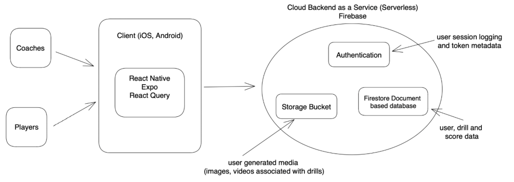

# golf-drill-challenge-app

## About
This app is designed for the Oregon State University Mens' Golf Team. The app aims at providing a modern approach at managing, sharing, and assigning drills, as well as tracking progress across the team. The app enables coaches to upload drills accompanied with media in advance, and assign them to players. Players can then view drills, with the corresponding directions and media, and upload their scores as they complete drills. Coaches can view player data as a whole, or zone in on an individual players performance.

## Tooling and Environment

Our app client is built using [React Native](https://reactnative.dev) and [Expo](https://expo.dev), and we process data and authentication via [Google Firebase](https://firebase.google.com).

In order to simplify development, some notable libraries we utilize include:
- [TanStack Query](https://tanstack.com/query/latest)
- [Axios](https://axios-http.com)
And some extensions we recommend are:
- [Prettier](https://prettier.io)

To begin developing:
1. Clone the repository
2. Install dependencies
   ```
   npm install
   ```
3. Install the Expo Go app on a physical device
   - [Download on iOS](https://apps.apple.com/us/app/expo-go/id982107779)
   - [Download on Android](https://play.google.com/store/apps/details?id=host.exp.exponent&hl=en_US&gl=US)

   OR

   Use an emulator such as the [iOS Simulator](https://docs.expo.dev/workflow/ios-simulator/), or the [Android Studio Emulator](https://docs.expo.dev/workflow/android-studio-emulator/).
   
   *Note about running on Android Studio Emulator* 
   
   There is a known bug that prevents users from using the Sign-in with Google functionality. 
   To bypass this, the emulator must be run from the command line with a flag disabling the Vulkan feature.
   Read this article to learn how to run the emulator from the command line: (https://developer.android.com/studio/run/emulator-commandline), 
   And this article on the flag to disable the Vulkan feature: (https://developer.android.com/studio/run/emulator-troubleshooting#error:-%60vulkan-1.dll)  

4. Start the development server
   ```
   npx expo start
   ```

   OR if your WIFI network does not support peer to peer:
   ```
   npx expo start --tunnel
   ```
   Learn more about tunneling [here](https://docs.expo.dev/more/expo-cli/?redirected#tunneling)

## System Architecture
Our app is seperated into 2 main pieces, a client and a backend as a service, consisting of various Google Firebase services.

Below is a diagram showing the overall design of the application:



## Roadmap

Some unrealized features that can be work on include:

   - Notification on drill being assigned to a user.
   - expanded data viewing and parsing for both coaches and players in individual view.
   - Random distance generation aid for drill creation.

Other improvements (non-features) that can be worked on include:

   - Better integration and consolidation of player/coach screens.
   - Better re-use of components shared among both type of users.
   - Extraction and consolidation of styles and theming elements to ensure consistency and ease of adaptability and maintainability for changes.
   - Consolidation of authentication and user data propagation.
   - Improved state management (possibly using redux or React Reducers with native Context API).

## Credits
Developed by:
   - Emmanuel Moncada ([@efmmoncada](https://github.com/efmmoncada))
   - Eduardo Gonzalez ([@Eduardo-Gonz](https://github.com/Eduardo-Gonz))
   - Kathleen Ashley ([@srslyashh](https://github.com/srslyashh))
   - Jermaine Lara ([@Jermainelr](http://github.com/Jermainelr))
   - Getaneh Kudna ([@Getaneh90](https://github.com/Getaneh90))
   - Brendan Baldocchi ([@BrendanBaldocchi2](https://github.com/BrendanBaldocchi2))
